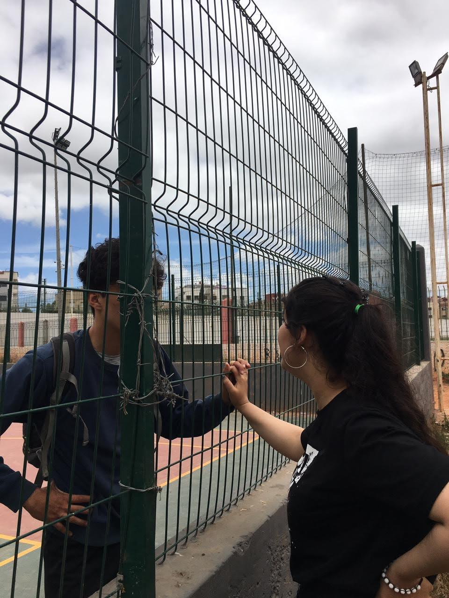
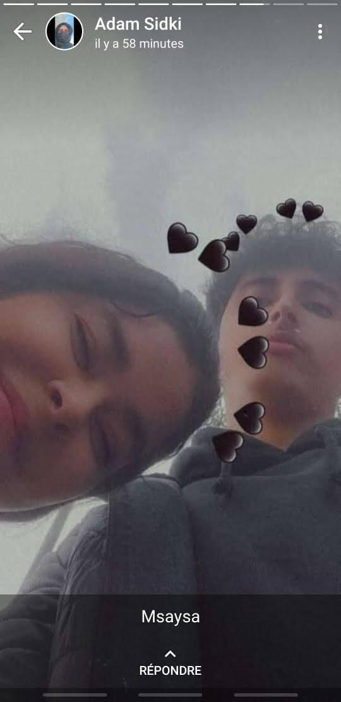

[index.html.txt](https://github.com/user-attachments/files/25377561/index.html.txt)
<!DOCTYPE html>
<html lang="en">
<head>
  <meta charset="UTF-8">
  <title>Happy Birthday My Love ❤️</title>
  <meta name="viewport" content="width=device-width, initial-scale=1.0">

  <!-- Google Font -->
  <link href="https://fonts.googleapis.com/css2?family=Poppins:wght@300;500;700&display=swap" rel="stylesheet">

  
</head>

<body>

  

    <h1>Happy Birthday My Love 🎂❤️</h1>

    

      From the moment you came into my life, everything became more beautiful.
      Today is your special day, and I wanted to make you something unique…
      just like you 💖
    

    
💕 💕 💕

    <!-- PHOTO GALLERY -->
    

      <!-- Replace image links with your photos -->
      
      
      
      
    

    <!-- LOVE MESSAGE -->
    

      <h2>A Message For You 💌</h2>
      

        You are my happiness, my peace, and my favorite person in the world.
        Thank you for every smile, every hug, and every memory we share.
        I love you more than words can explain ❤️
      

    

    <footer>
      Made with love by adam 💕
    </footer>

  

</body>
</html>
